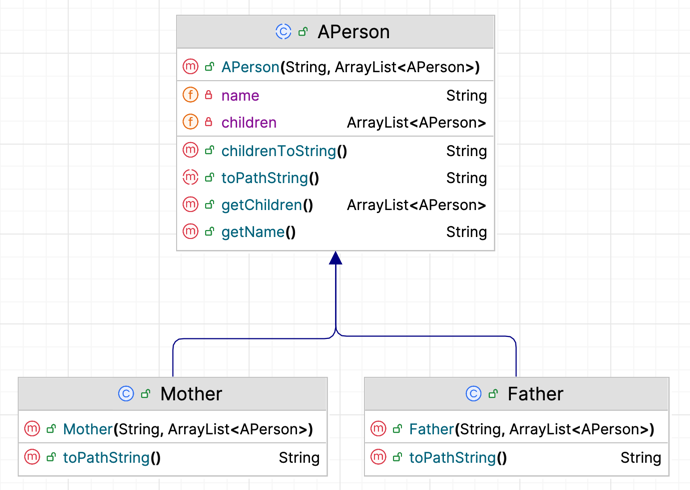
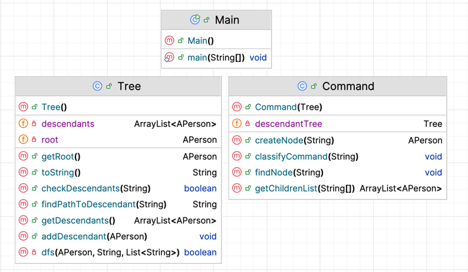

# Futatsu
**Purpose** -- to review Java and data structures -- warmup for the course project.

**Delivery** 

The main project module is DescendantTree.
Java classes are in DescendantTree/src/main/java .
Test cases are in DescendantTree/src/test/java.
Test resources are in DescendantTree/src/test/resources.
The jar file is in DescendantTree/out/artifacts directory.

### Programming Task
Design and implement a descendent tree and a method for finding the path, if
any, from the root to a given descendant.

Assumptions:
- a person is either a mother or a father but might not
have any descendants.
- if a person is being given children, the children have already been listed before them
- all input lines to STDIN follow the syntax to create or find a node properly
- all people are part of the same tree

#### Input format

Program takes input from STDIN. Each line can either define a new person in the
descendent tree or ask to find a path to a person in the tree. Here is an example showing the
format for defining a person with multiple (3) or without  descendants in the tree and demonstrating 
the format for asking to find a path to a person:

```    
mother Jade
father Jean
mother Judith
mother Juliette Judith Jean Jade
find Jaen
find Juliette
find Jean
```
#### Output format
Your program will write the path to the person in the tree, if any, into STDOUT. The path will
have the roles of the persons on the path, not their names. Here is an example using the input above:
```
path from "Juliette" to "Jaen" is #f
path from "Juliette" to "Juliette" is ()
path from "Juliette" to "Jean" is ("mother")
```
---
### Java Classes
package: edu.duke.futatsu.warmup2


---
APerson.java
```
Abstract class with fields and methods to be inherited by Mother and Father. 
Every APerson gets a String name and an ArrayList for children(may be empty). 
ToPathString() left unimplemented
```
Father.java
```
Implements APerson
ToPathString() returns "father"
```
Mother.java
```
Implements APerson
ToPathString() returns "mother"
```


Tree.java
```
Holds a list of all descendants that have been added to the tree and the current root.
Methods allow you to add a new descendant, check the root, check the list of descendents, and find the path from root to target
```

Command.java
```
Handles the classification of command line inputs as a creation or a find.
Can create a Mother or Father and add them to the current descendant tree.
Can call the find path method on the given descendant tree.
```

Main.java
```
Prompts user for input and calls method to classify each command.
```

### Testing Task
4 tests are placed in the MainTest.java class. Each test uses two files: 
1. A test input labeled n-in.txt.
2. An expected output n-out.txt.