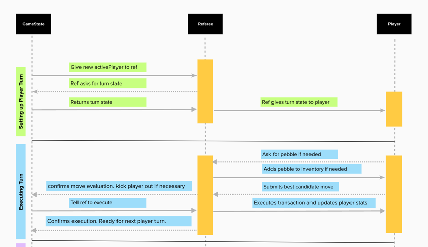

## Memo: Player Protocol Memo
**TO**: CEOs  
**FROM**: Team Futatsu  
**DATE**: 11/13/24  
**SUBJECT**: Player protocol for communication between referee and player.

As turns are taken in Bazaar, the referee will need to communicate with the player to pass information and receive decisions about what the player wants to do. This memo outlines the protocol for that communication between the referee and player.

### **Player Protocol Design**

#### Overview
The player has no knowledge of the referee nor should it need to, in fact it would a concern if it was able to. However, the referee does know about the player and in fact is passed the `activePlayer` through the `Turn_State` object. Because of this, and the referee needing to access the player's information, the referee can call a method in the `Player` to send the player information at the start of each turn. However, the referee would need to wait for a response from the player before it can continue with the turn. This implies the use of an Observer pattern. One where the player could asynchronously send information at which point the referee is notified and can continue to execute the turn.

#### Diagram

#### Explain Flow
The protocol between the `Referee` and `Player` is laid out in the sequence diagram above. This flow shows the actions that `Player` and `Referee` perform in order and their dependence on eachother. `Player` will need a way to have proxy acces to `Referee` in order to call methods that notify the `Refereee` to perform actions. The key interaction phases between `Player` and `Referee` occur when the `Refere`e sets up the players turm by giving it the `Turn_State` and during turn execution when a `Player` submits a `Candidate` for the `Referee` to evaluate and execute.
