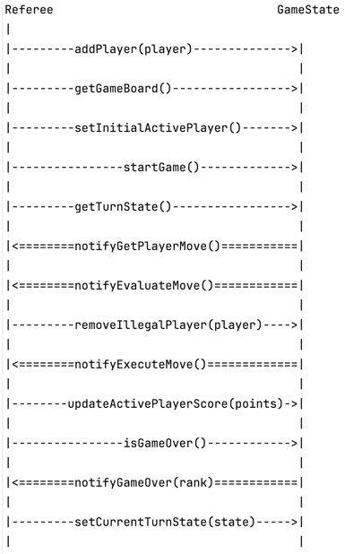

## Memo: Referee Interaction with GameState
**TO**: CEOs  
**FROM**: Team Futatsu  
**DATE**: 11/26/24  
**SUBJECT**: Referee protocol for interacting with Game State.

#### Introduction
The `Referee` serves as a controller that manages the game's progression turn by turn, coordinating with the `Game_State`, which tracks the game's current status and provides mechanisms for state manipulation. The interaction protocol for the Referee and GameState components is managed by interfaces entitled `GameStateActionsForRef` and `RefActionsForGameState`. The main functionality of these interfaces is described below:

**1. Game Initialization**
    - The `Referee` calls `GameState``addPlayer(Player player)` to add initial game members 
    - The `Referee` gets `GameState` gameboard equations so it can `setupPlayersWithEqs()`
    - The `Referee` calls `GameState` `setInitialActivePlayer()` so that the first turn can occur properly.
    - The `Referee` calls `GameState` `startGame()` to start the finite state machine rotation.
  
**2. Turn Management**
   For each turn:

- Active Player's Turn:
  - The `GameState` transitions to ACTIVE_PLAYER_TURN: gameState tells ref to `getPlayerMove()`
  - The `Referee` fetches the current turn state using `getTurnState()` and interacts with the active player to request their move.

- Move Evaluation:
  - The `GameState` transitions to EVALUATE_MOVE: gameState tells ref to `evaluateMove()`
  - The `Referee` calls `checkValidMove()` to ensure the move's legality and tells gameState to `removeIllegalPlayer(Player player)` if necessary.

- Move Execution:
  - The `GameState` transitions to EXECUTE_MOVE: gameState tells ref to `executeMove()`
  - The `Referee` executes the validated transaction and calls `updateActivePlayerScore(int points)` to update gameState's records.
  - The `Referee` checks `isGameOver()` conditions in gameState

- Next Player:
  - The `GameState` transitions to NEXT_PLAYER_TURN: its activePlayer is updated and ready to take a turn.

**3. Game End**
   - When `isGameOver()` returns true, the `GameState` transitions to GAME_OVER, and the `Referee` is sent the final rankings using `endGame()`.
   - The `Referee` sends the ranking report to all players.

**4. Pause/Resume Functionality**
   To pause and resume the game:

- Pause:
  - The `Referee` retrieves the current turn state using `getTurnState()` and saves it.
- Resume:
  - The saved turn state is passed to the GameState via `setCurrentTurnState(Turn_State state)`.

*The sequence described above is shown below:*

